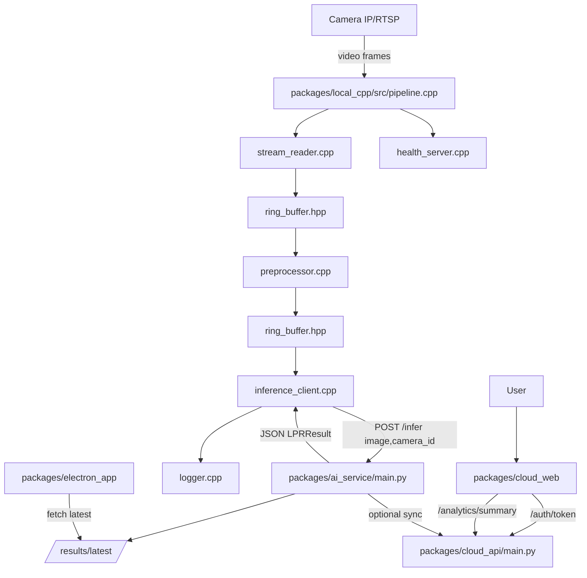

what does each file do in the program and also draw a flow chart of the whole situation

### Overall summary
This monorepo implements a hybrid-tier License Plate Recognition (LPR) system with three tiers: a Local edge tier (C++ streaming client, Python AI FastAPI, Electron desktop), and a Cloud tier (FastAPI backend with JWT auth, Next.js dashboard). The local C++ app captures/decodes a camera stream, preprocesses frames, calls the Python AI `/infer` for plate OCR, and exposes a health/metrics endpoint. The Electron app polls the AI results. The cloud API provides login/token issuance and analytics endpoints; the Next.js app serves the Farsi RTL dashboard.

Major runtime flows include: camera stream → C++ pipeline → Python AI `/infer` → local logs and optional cloud sync; and user → Next.js login → Cloud API JWT → analytics endpoints.

### File-by-file analysis

- `README.md`
  - One-line: Top-level documentation (this file). Now includes full analysis and flowcharts.
  - Details: Describes the architecture, quick start steps, and now the requested program analysis, flows, and JSON summary.
  - Inputs/outputs: N/A. Links to package run commands.
  - Depends on: N/A. Referenced by users.
  - Concerns: Keep up-to-date as components evolve.
  - Suggestions: Split operational guides vs. analysis into separate docs later.
  - Size/Criticality: small, medium criticality.

- `EXTENSIBILITY.md`
  - One-line: Extensibility guide for adding features (vehicle type/color, anomaly detection, cloud sync).
  - Details: Lists extension points in AI service and cloud API, with pseudo-code and config options.
  - Inputs: Developer intent; Outputs: guidance.
  - Depends on: `packages/ai_service/main.py`, `packages/cloud_api/main.py`.
  - Concerns: None functional; guidance only.
  - Suggestions: Add concrete code samples per extension.
  - Size/Criticality: medium, low.

- `config.json` (root)
  - One-line: Not used by code; ignore or remove. (Primary configs live in package-level files.)
  - Details: If present, should clarify scope; currently unused.
  - Suggestions: Delete or document.
  - Size/Criticality: very small, low.

- `logs/cpp_client.log`
  - One-line: Example/aggregate of local C++ client logs.
  - Details: Contains structured log lines from the C++ pipeline; used for troubleshooting.
  - Inputs: Logger events; Outputs: file lines.
  - Suggestions: Rotate and compress in production.
  - Size/Criticality: varies, low.

#### packages/ai_service
- `packages/ai_service/main.py`
  - One-line: Python FastAPI service for LPR detection/OCR and results retrieval.
  - Details: Exposes `/infer` (multipart image + `camera_id`) returning `LPRResult`, `/results/latest` for recent results, `/healthz` for health. Uses optional YOLOv8 + EasyOCR when available; otherwise a dummy detector. Logs JSONL to `logs/inference.jsonl`. Supports anonymized cloud sync when enabled via env.
  - Key functions/classes:
    - `LPRResult`, `BBox` (pydantic models): output schema with plate text, confidence, bbox.
    - `get_yolo_model()`, `get_easyocr()`: lazy model initializers (optional).
    - `dummy_detect_and_ocr(image_bytes)`: center-box placeholder result.
    - `detect_plate_and_ocr(image_bytes)`: tries YOLO+OCR then falls back.
    - `detect_vehicle_color(image_bytes, bbox)`: simple HSV heuristic.
    - `maybe_sync_to_cloud(result)`: optional POST to Cloud API with anonymization.
    - FastAPI endpoints: `/infer`, `/results/latest`, `/healthz`.
  - Inputs: multipart `image` (binary), `camera_id` (str). Env: `CONFIDENCE_THRESHOLD`, `CLOUD_API_URL`, `CLOUD_SYNC_ENABLED`, `CLOUD_API_TOKEN`.
  - Outputs: JSON `LPRResult`, writes logs.
  - Depends on: PIL, numpy, FastAPI, optional ultralytics/easyocr, `packages/shared/schemas/lpr_result.schema.json` conceptually.
  - Concerns: Optional model imports may be heavy; catching broad exceptions; dummy bbox uses w/h not x2/y2 (OK but note format differences with Cloud); ensure thread-safety if models are shared.
  - Suggestions: Use ONNXRuntime/ORT for reproducible inference; validate inputs; standardize bbox format across tiers.
  - Size/Criticality: medium-large, high.

- `packages/ai_service/requirements.txt`
  - One-line: Python dependencies for AI service.
  - Details: fastapi, uvicorn, Pillow, opencv-headless, numpy, orjson, optional ultralytics and easyocr.
  - Concerns: torch/ultralytics are heavy; ensure wheels available.
  - Size/Criticality: small, high (build-time).

- `packages/ai_service/config.env.example`, `packages/ai_service/logs/`
  - One-line: Example env and log directory.
  - Details: sample configurable values and output location for logs.
  - Size/Criticality: very small, low.

#### packages/cloud_api
- `packages/cloud_api/main.py`
  - One-line: Cloud FastAPI with JWT login and analytics endpoints.
  - Details: Provides `/auth/token` (expects `username` and `password::api_token` form), seeds an `admin` user in SQLite on first run, `/ingest/lpr` for receiving results, `/analytics/summary`, `/ws/analytics` (basic websocket), `/healthz`. Uses SQLModel + SQLite and PBKDF2 password hashing.
  - Key components:
    - `UserDB` (SQLModel): stores username, password_hash, api_token, is_active.
    - `create_token`, `get_current_user`: JWT issued and verified via `OAuth2PasswordBearer`.
    - Endpoints: `/auth/token`, `/ingest/lpr`, `/analytics/summary`, `/ws/analytics`, `/healthz`.
  - Inputs: form-encoded login; bearer tokens for protected routes.
  - Outputs: JWT tokens; JSON summaries.
  - Depends on: passlib, pyjwt, sqlmodel, sqlite3; CORS middleware.
  - Concerns: Demo login combining password::token is awkward; no RBAC; no rate-limiting beyond config; sqlite path hard-coded.
  - Suggestions: Provide JSON login endpoint with three fields; add migrations and proper user CRUD; add rate limiting.
  - Size/Criticality: medium, medium-high.

- `packages/cloud_api/requirements.txt`, `config.env.example`, `cloud_lpr.db`
  - One-line: Dependencies, sample env, and sqlite DB file.
  - Details: DB is runtime artifact; not meant for VCS long-term.
  - Concerns: Commit of DB can lead to stale seeds.
  - Size/Criticality: small, medium.

#### packages/cloud_web
- `packages/cloud_web/pages/index.tsx`
  - One-line: Farsi RTL dark-themed dashboard with gated login and analytics view.
  - Details: Full-screen login that posts to Cloud API `/auth/token` (username, password, token via password::token), stores JWT in `localStorage`, then shows sidebar + KPI cards + tables + ECharts charts with tabs (hour/day/week/month/year). API URL configurable in the UI.
  - Key parts: `login()`, `loadSummary()`, chart components using `echarts`, time-range tabs; RTL styling via `styles/global.css`.
  - Inputs: API URL, credentials, user actions; Outputs: Rendered dashboard.
  - Depends on: `pages/_app.tsx`, `_document.tsx` (RTL/lang), `styles/global.css`.
  - Concerns: Using password::token is brittle; no refresh token; no 2FA.
  - Suggestions: Switch backend to accept JSON with separate token field; add proper error toasts and loading states.
  - Size/Criticality: medium, high for UX.

- `packages/cloud_web/pages/_app.tsx`, `_document.tsx`, `styles/global.css`, `next.config.js`, `package.json`, `tsconfig.json`
  - One-line: Next.js scaffolding, global styles (dark RTL), app chrome.
  - Details: `_document.tsx` sets `lang="fa" dir="rtl"`, `_app.tsx` wraps content with dark container, CSS provides components, tabs, animations.
  - Concerns: Global CSS grows; consider CSS modules or Tailwind later.
  - Size/Criticality: small-medium, medium.

#### packages/electron_app
- `packages/electron_app/main.js`
  - One-line: Electron main process creating a window and IPC handler to fetch latest results from the AI service.
  - Details: Loads `renderer.html`, exposes `ipcMain.handle('fetch-latest', ...)` which fetches `GET {host}/results/latest?limit=...` and returns JSON to renderer.
  - Inputs: host from renderer; Outputs: JSON results.
  - Depends on: node-fetch, Electron APIs.
  - Concerns: No error UI; no auto-retry; no packaging config yet.
  - Suggestions: Add preload script and contextIsolation; handle fetch errors.
  - Size/Criticality: small, medium.

- `packages/electron_app/renderer.html`
  - One-line: Dark RTL table view of latest AI results with host input.
  - Details: Simple DOM script polling every 3 seconds, shows timestamp/camera/plate/confidence/bbox; stores host in `localStorage`.
  - Concerns: No pagination; direct `require` in renderer; consider secure preload.
  - Size/Criticality: small, medium.

- `packages/electron_app/package.json`, `config.json.example`
  - One-line: App metadata and example config.
  - Details: Declares Electron and node-fetch deps; `npm start` to run.
  - Size/Criticality: small, low.

#### packages/local_cpp (C++ edge client)
- `packages/local_cpp/src/main.cpp`
  - One-line: Entry point for full streaming pipeline (config-driven).
  - Details: Loads `config.json`, constructs `Pipeline`, starts health server, stream reader, preprocess and inference threads; graceful shutdown on SIGINT/SIGTERM; prints final stats.
  - Key functions: `signal_handler`, main loop checking `config.config_changed`, pipeline lifecycle.
  - Inputs: `config.json`; Outputs: logs, health endpoints.
  - Depends on: `pipeline.hpp` and component classes.
  - Concerns: Hot-reload only flagged; full restart not yet automated.
  - Size/Criticality: medium, high.

- `packages/local_cpp/src/pipeline.(hpp|cpp)`
  - One-line: Orchestrates components (stream, preprocess, inference, logging, health, metrics).
  - Details: Holds rings for frame and inference queues, stats, and threads; pushes frames through preprocess and inference; updates health server; logs periodic stats.
  - Key methods: `start()`, `stop()`, `preprocess_loop()`, `inference_loop()`, `metrics_loop()`, callbacks for stream and AI health.
  - Inputs: frames from `StreamReader`; Outputs: inference calls, logs, metrics.
  - Depends on: all component headers.
  - Concerns: If RTSP fails, it retries with backoff; add stream URL discovery.
  - Size/Criticality: large, high.

- `packages/local_cpp/src/stream_reader.(hpp|cpp)`
  - One-line: Captures frames from RTSP/HTTP using OpenCV `VideoCapture`.
  - Details: Tries FFMPEG/GStreamer backends; configurable fps cap; reconnects with exponential backoff; emits frames via callback.
  - Inputs: `stream.url` and config; Outputs: `Frame` objects.
  - Depends on: OpenCV.
  - Concerns: Some cameras require specific RTSP paths; consider probing.
  - Size/Criticality: medium, high.

- `packages/local_cpp/src/preprocessor.(hpp|cpp)`
  - One-line: Resizes (letterbox), gamma, denoise, sharpen, quality filtering.
  - Details: Computes quality score (sharpness/brightness/contrast) to drop bad frames; returns processed frame.
  - Inputs: `Frame` with `cv::Mat`; Outputs: modified `Frame`.
  - Depends on: OpenCV.
  - Size/Criticality: medium, medium.

- `packages/local_cpp/src/inference_client.(hpp|cpp)`
  - One-line: Sends frames to Python AI `/infer` via libcurl.
  - Details: Encodes JPEG, builds multipart form, retries, tracks latency/stats, parses JSON response to `InferenceResult`.
  - Inputs: `Frame`; Outputs: `InferenceResult`.
  - Depends on: libcurl, nlohmann/json.
  - Concerns: Ensure bbox format consistent; handle large images memory.
  - Size/Criticality: medium, high.

- `packages/local_cpp/src/health_server.(hpp|cpp)`
  - One-line: Minimal HTTP server exposing `/healthz`, `/status`, `/metrics`.
  - Details: Cross-platform sockets (Win/POSIX); emits process health, AI/stream status, FPS, queue size; Prometheus metrics.
  - Inputs: internal metrics; Outputs: HTTP text/JSON.
  - Depends on: sockets.
  - Concerns: Not hardened; only local/admin use.
  - Size/Criticality: medium, medium.

- `packages/local_cpp/src/config.(hpp|cpp)`
  - One-line: Loads/saves config JSON and optional hot-watch.
  - Details: Holds structs for stream, pipeline, preprocessing, privacy, logging, health, AI service; watches file for modification; custom copy to avoid copying atomics.
  - Inputs/Outputs: `config.json` file.
  - Depends on: nlohmann/json.
  - Size/Criticality: medium, medium.

- `packages/local_cpp/src/logger.(hpp|cpp)`
  - One-line: Structured logging (file + console), rotation, formatting helpers.
  - Details: INFO/DEBUG/WARN/ERROR levels; JSON payloads for frames and inferences; daily rotation.
  - Size/Criticality: medium, medium.

- `packages/local_cpp/src/frame.hpp`
  - One-line: Data structs for `Frame` and `InferenceResult`.
  - Details: `Frame` wraps `cv::Mat` and metadata; `InferenceResult` stores parsed AI output.
  - Size/Criticality: small, medium.

- `packages/local_cpp/src/ring_buffer.(hpp|cpp)`
  - One-line: Lock-free ring buffer template with non-blocking push/pop and blocking pop with timeout.
  - Details: Bounded capacity for backpressure; used between stages.
  - Size/Criticality: small, medium.

- `packages/local_cpp/src/simple_main.cpp`
  - One-line: Minimal image-to-`/infer` client for quick testing.
  - Details: Reads a file, builds multipart with libcurl, prints JSON.
  - Size/Criticality: small, low.

- `packages/local_cpp/CMakeLists.txt`, `CMakeLists_simple.txt`
  - One-line: Build configs for full and simple clients.
  - Details: Finds CURL, OpenCV, nlohmann_json; links; installs outputs.
  - Size/Criticality: small, high for builds.

- `packages/local_cpp/config.json`, `config.json.example`
  - One-line: Runtime config for C++ client.
  - Details: Stream URL, camera ID, AI service host, queues, preprocessing; example file for defaults.
  - Size/Criticality: small, high.

- `packages/shared/schemas/lpr_result.schema.json`
  - One-line: JSON schema for `LPRResult`.
  - Details: Validates timestamp, camera_id, plate_text, confidence, bbox.
  - Size/Criticality: small, medium.

- Generated/build artifacts (not analyzed individually):
  - `packages/local_cpp/build*/**`, `packages/cloud_web/node_modules/**`, `packages/electron_app/node_modules/**`, `packages/cloud_api/cloud_lpr.db`, compiled DLLs/EXEs.
  - These are machine-generated binaries or vendor code; for analysis provide source or build steps.

### Flow chart



ASCII summary:
- Camera → C++ stream_reader → preprocessor → inference_client → Python AI `/infer` → results/logs; health at `/healthz`, `/status`, `/metrics`.
- Electron polls AI `/results/latest` and displays recent inferences.
- Next.js web → Cloud API `/auth/token` for JWT, `/analytics/summary` for data; AI can optionally sync anonymized results to Cloud API.

Main paths: Edge flow sends frames through the C++ pipeline to the AI and logs results locally; Cloud flow authenticates users and serves analytics. Error paths include RTSP reconnects and AI retries; health endpoints reflect degraded states.

### JSON summary

```json
{
  "README.md": {"summary": "Top-level documentation and analysis.", "deps": []},
  "EXTENSIBILITY.md": {"summary": "Guide for extending AI and cloud features.", "deps": ["packages/ai_service/main.py", "packages/cloud_api/main.py"]},
  "packages/ai_service/main.py": {"summary": "FastAPI AI service exposing /infer, /results/latest, /healthz with optional YOLO+EasyOCR.", "deps": ["Pillow", "numpy", "ultralytics", "easyocr"]},
  "packages/ai_service/requirements.txt": {"summary": "Python dependencies for AI service.", "deps": []},
  "packages/cloud_api/main.py": {"summary": "JWT auth, analytics, ingest, health, websocket using FastAPI + SQLModel.", "deps": ["sqlmodel", "pyjwt", "passlib"]},
  "packages/cloud_api/requirements.txt": {"summary": "Python dependencies for Cloud API.", "deps": []},
  "packages/cloud_web/pages/index.tsx": {"summary": "Farsi RTL dashboard with login and charts.", "deps": ["echarts", "Next.js"]},
  "packages/cloud_web/pages/_app.tsx": {"summary": "Wraps Next.js pages and applies dark theme.", "deps": []},
  "packages/cloud_web/pages/_document.tsx": {"summary": "Sets lang=fa and dir=rtl.", "deps": []},
  "packages/cloud_web/styles/global.css": {"summary": "Dark RTL styles, animations, tables, tabs.", "deps": []},
  "packages/electron_app/main.js": {"summary": "Electron main process, window creation, IPC to fetch latest results.", "deps": ["node-fetch"]},
  "packages/electron_app/renderer.html": {"summary": "Renderer UI polling AI results.", "deps": ["packages/electron_app/main.js"]},
  "packages/local_cpp/src/main.cpp": {"summary": "Entry for full pipeline, starts threads and health.", "deps": ["pipeline.hpp"]},
  "packages/local_cpp/src/pipeline.cpp": {"summary": "Coordinates stream, preprocess, inference, logging, metrics.", "deps": ["stream_reader.hpp", "preprocessor.hpp", "inference_client.hpp", "logger.hpp", "health_server.hpp"]},
  "packages/local_cpp/src/stream_reader.cpp": {"summary": "OpenCV VideoCapture RTSP/HTTP reader with backoff.", "deps": ["opencv"]},
  "packages/local_cpp/src/preprocessor.cpp": {"summary": "Resize/letterbox, gamma, denoise, sharpen, quality filter.", "deps": ["opencv"]},
  "packages/local_cpp/src/inference_client.cpp": {"summary": "libcurl multipart uploader to AI /infer, JSON parse to result.", "deps": ["libcurl", "nlohmann_json"]},
  "packages/local_cpp/src/health_server.cpp": {"summary": "Tiny HTTP server exposing health, status, metrics.", "deps": []},
  "packages/local_cpp/src/config.cpp": {"summary": "Load/save/watch config JSON.", "deps": ["nlohmann_json"]},
  "packages/local_cpp/src/logger.cpp": {"summary": "File/console logger with rotation.", "deps": []},
  "packages/local_cpp/src/frame.hpp": {"summary": "Frame and InferenceResult types.", "deps": ["opencv"]},
  "packages/local_cpp/src/ring_buffer.hpp": {"summary": "Lock-free ring buffer template.", "deps": []},
  "packages/local_cpp/src/simple_main.cpp": {"summary": "Minimal image POST client for AI.", "deps": ["libcurl"]},
  "packages/local_cpp/CMakeLists.txt": {"summary": "CMake for full streaming client.", "deps": ["CURL", "OpenCV", "nlohmann_json"]},
  "packages/local_cpp/config.json": {"summary": "Runtime config for client (stream, ai, pipeline).", "deps": []},
  "packages/shared/schemas/lpr_result.schema.json": {"summary": "JSON schema for AI result.", "deps": []}
}
```

### Extras
- Top 5 TODOs
  1. Add auto-discovery of RTSP paths (brand-based probing + ONVIF optional) so users only enter IP/user/pass.
  2. Replace password::token with JSON login (username, password, api_token) in Cloud API + Next.js.
  3. Standardize bbox format across tiers (x,y,w,h vs x1,y1,x2,y2) and validate.
  4. Package Electron with secure preload and contextIsolation; error handling and toasts.
  5. Add integration tests: C++ → AI → Cloud ingest, plus load testing for stream reconnects.

- Build/run commands
  - AI service: `cd packages/ai_service && pip install -r requirements.txt && uvicorn main:app --host 0.0.0.0 --port 8000 --reload`
  - C++ client (simple version, pre-built): `cd packages/local_cpp && .\simple_cpp_client.exe test_image.jpg CAM01 http://127.0.0.1:8000`
  - C++ client (full version): `cd packages/local_cpp/build_full && .\Release\local_cpp_client.exe` (configure `packages/local_cpp/config.json`)
  - Electron app: `cd packages/electron_app && npm i && npm start`
  - Cloud API: `cd packages/cloud_api && pip install -r requirements.txt && uvicorn main:app --host 0.0.0.0 --port 9000 --reload`
  - Cloud Web: `cd packages/cloud_web && npm i && npm run dev`
  - Discovery Service: `python discovery_service.py` (runs on port 8085, enables camera discovery in Electron app)

- Quick Start Guides
  - [GETTING_STARTED.md](GETTING_STARTED.md) - Step-by-step instructions to run essential services
  - [RUNNING_SERVICES.md](RUNNING_SERVICES.md) - Detailed instructions for running each component
  - [START_HERE.md](packages/local_cpp/tests/START_HERE.md) - RTSP diagnostics and troubleshooting

- Startup Scripts
  - [start-essential.bat](start-essential.bat) - Windows batch script to start essential services
  - [start-essential.ps1](start-essential.ps1) - PowerShell script to start essential services
  - [start-electron.bat](start-electron.bat) - Windows batch script to start Electron desktop app
  - [start-electron.ps1](start-electron.ps1) - PowerShell script to start Electron desktop app
  - [start-full-system-with-cpp.bat](start-full-system-with-cpp.bat) - Windows batch script to start all services including C++ client info
  - [test-cpp-client.bat](test-cpp-client.bat) - Windows batch script to test the C++ client with a sample image

- Suggested tests
  - Unit: preprocessor quality metrics; inference JSON parsing; config hot-reload edge cases.
  - Integration: RTSP stream → AI `/infer` happy-path and failure (AI down, RTSP down); Cloud login flow and token expiry; Electron fetching and rendering.


### Recent changes

- Added RTSP auto-discovery endpoint to local C++ health server: `POST http://127.0.0.1:8085/discover?ip=...&user=...&pass=...&brand=reolink` returns brand-prioritized candidate RTSP URLs (Reolink first, plus common fallbacks).
- Wired discovery handler in `packages/local_cpp/src/pipeline.cpp` to generate candidates without blocking the running stream.
- Hardened Electron app: enabled secure `preload`, `contextIsolation: true`, `sandbox: true`; removed direct `require` from renderer; added toast error notifications and a discovery UI card that calls `/discover`.

How to use RTSP discovery (local client running):
- Open the Electron app → fill IP, user, pass, brand → click کشف. The app calls `/discover` and shows candidate RTSP URLs. Choose one and set it in `packages/local_cpp/config.json` under `stream.url`, then restart the C++ client.

Notes:
- The current discovery returns candidates; an optional enhancement is to actively probe and return the first verified URL.

### Full project flowchart

```mermaid
flowchart TD
  subgraph Edge/Local
    CAM[Camera (IP only)] --> DISC[/discover (HealthServer)\nbrand-based RTSP candidates/]
    DISC -. Electron calls .-> ELEC[Electron Renderer\n(preload bridge, toasts)]
    ELEC -->|poll /results/latest| AI[AI Service (FastAPI)]
    CAM -->|RTSP stream| CXX[pipeline.cpp]
    CXX --> SR[stream_reader.cpp]
    SR --> PP[preprocessor.cpp]
    PP --> IC[inference_client.cpp]
    IC -->|POST /infer| AI
    AI -->|LPRResult JSON| IC
    IC --> LOG[logger.cpp]
    CXX --> HS[health_server.cpp\n/healthz, /status, /metrics, /discover]
  end

  subgraph Cloud
    WEB[Next.js (Farsi, dark)] -->|/auth/token| API[Cloud API (FastAPI)]
    WEB -->|/analytics/summary| API
    API --> DB[(SQLite)]
    API === WS[/ws/analytics/]
  end

  AI -. optional anonymized sync .-> API
  ELEC -. operator .-> WEB
```

### ASCII full architecture

```
┌─────────────────────────┐      ┌──────────────────────────┐      ┌──────────────────────────┐
│       Camera (IP)       │      │        C++ Client        │      │     Python AI Service     │
│   RTSP stream provider  │ ───▶ │  Stream→Preproc→Infer    │ ───▶ │   FastAPI /infer, latest  │
│  (Reolink, Hik, Dahua)  │      │  Health, Metrics, Discover│      │    YOLO/EasyOCR + logs    │
└─────────────────────────┘      └──────────────────────────┘      └──────────────────────────┘
               │                              │    ▲                           │
               │                              │    │                           │
               │                              ▼    │                           ▼
               │                   ┌──────────────────────────┐        ┌──────────────────────────┐
               │                   │   Health Server (8085)   │        │  /results/latest (poll)  │
               │                   │ /healthz /status /metrics│        └──────────────────────────┘
               │                   │  POST /discover?ip...    │
               │                   └──────────────────────────┘
               │                              ▲
               │                              │  calls /discover
               │                              │
               ▼                              │
┌─────────────────────────┐                  ┌─┴─────────────────────────┐
│     Electron Desktop    │◀──────────────── │       Preload Bridge      │
│  Dark RTL (Farsi), UI   │    window.lpr    │ contextIsolation enabled  │
│  - Poll AI latest       │                  └───────────────────────────┘
│  - RTSP discovery card  │
└─────────────────────────┘

                                           optional anonymized sync
                                                          │
                                                          ▼
                                        ┌──────────────────────────┐
                                        │     Cloud API (FastAPI)  │◀───────────┐
                                        │  /auth/token (JWT)       │            │
                                        │  /ingest/lpr             │            │
                                        │  /analytics/summary      │            │
                                        │  /ws/analytics           │            │
                                        └───────────┬──────────────┘            │
                                                    │                           │
                                                    ▼                           │
                                        ┌──────────────────────────┐            │
                                        │         SQLite DB        │            │
                                        └──────────────────────────┘            │
                                                                                │
                                                                                ▼
                                                        ┌──────────────────────────┐
                                                        │    Cloud Web (Next.js)   │
                                                        │  Dark RTL (Farsi)        │
                                                        │  Login → Analytics       │
                                                        │  Charts (ECharts)        │
                                                        └──────────────────────────┘
```
